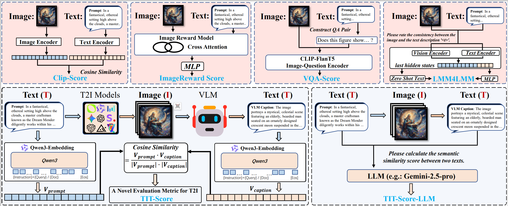

# TIT-Score: Evaluating Long-Prompt Based Text-to-Image Alignment via Text-to-Image-to-Text Consistency
[](https://arxiv.org/abs/2510.02987) [](https://opensource.org/licenses/MIT)  This repository contains the official implementation and resources for the paper: **TIT-SCORE: EVALUATING LONG-PROMPT BASED TEXT-TO-IMAGE ALIGNMENT VIA TEXT-TO-IMAGE-TO-TEXT CONSISTENCY**.

Our work addresses a critical gap in the evaluation of Text-to-Image (T2I) models: their ability to follow long and detailed prompts. To tackle this, we introduce:
1. **LPG-Bench**: A comprehensive benchmark specifically designed for evaluating long-prompt T2I generation.
2. **TIT-Score**: A novel, zero-shot evaluation framework that measures text-image alignment through a "describe-then-compare" process, showing superior correlation with human judgment.

---

## 🚀 Key Features

### LPG-Bench: A New Long-Prompt Benchmark
**Challenging by Design**: Contains 200 meticulously crafted prompts with an average length of over 250 words, pushing the limits of current T2I models.
**Extensive Image Set**: Includes 2,600 images generated by 13 state-of-the-art closed-source and open-source T2I models.
**Reliable Human Annotation**: Backed by comprehensive human-ranked annotations, resulting in 12,832 non-tie pairwise comparison results for robust evaluation.

### TIT-Score: A More Human-Aligned Metric
**Decoupled Evaluation**: Innovatively breaks down the complex cross-modal evaluation into two steps: (1) A Vision-Language Model (VLM) generates a rich text description of the image, and (2) the semantic consistency between the original prompt and this new description is calculated.**Two Powerful Instantiations**:
    **TIT-Score**: A computationally efficient and robust version using a text embedding model to calculate cosine similarity.
    **TIT-Score-LLM**: A peak-performance version that employs a frontier Large Language Model (e.g., Gemini 2.5 Pro) for the final similarity judgment, achieving a **7.31% absolute improvement** in pairwise accuracy over the strongest baseline.
    **Zero-Shot & Training-Free**: Requires no fine-tuning or training on human preference data, making it a highly generalizable and accessible evaluation tool.

---

## 🛠️ Getting Started

### Installation

1.  **Clone the repository:**
    ```bash
    git clone https://github.com/IntMeGroup/TIT-Score.git
    cd TIT-Score
    ```

2.  **Create a conda environment and install dependencies:**
    ```bash
    conda create -n tit-score python=3.10 -y
    conda activate tit-score
    ```

3.  **Install PyTorch:**
    Install a recent version of PyTorch (2.6 or newer is recommended). Please follow the official instructions at [pytorch.org](https://pytorch.org/) to find the correct command for your operating system and hardware (CPU/CUDA).

4.  **Install Transformers:**

    ```bash
    pip install transformers
    ```

### Download LPG-Bench

Our benchmark dataset, **LPG-Bench**, is hosted on the Hugging Face Hub.

*Please note: The human annotation data is currently being organized and will be released in a future update.*

* **For most users**, you can download the dataset by running the following command:
    ```bash
    huggingface-cli download --repo-type dataset --resume-download Moyao001/LPG-Bench --local-dir LPG-Bench
    ```

* **For users in mainland China** who may experience connectivity issues, it is recommended to use a mirror endpoint. You can set the environment variable before downloading:
    ```bash
    export HF_ENDPOINT=https://hf-mirror.com
    huggingface-cli download --repo-type dataset --resume-download Moyao001/LPG-Bench --local-dir LPG-Bench
    ```

---

## 📊 Usage

### Evaluating an Image with TIT-Score

For TIT-Score usage, please refer to the example below. You can search for and download various model weights from Hugging Face to combine as you see fit. We recommend using Qwen 2.5 VL and Qwen3-Embedding.

```python
import torch
import torch.nn.functional as F
from torch import Tensor
from PIL import Image
from transformers import AutoProcessor, AutoModelForCausalLM, AutoTokenizer, AutoModel

# This utility is provided by the Qwen-VL team.
# Ensure qwen_vl_utils.py is in the same directory or in your python path.
from qwen_vl_utils import process_vision_info

# --- 1. Configuration: Model Paths ---
# !! IMPORTANT: Update these paths to your local model directories.
VLM_MODEL_PATH = "/path/to/your/Qwen2.5-VL-72B-Instruct"
EMBEDDING_MODEL_PATH = "/path/to/your/Qwen3-Embedding-8B"

# --- 2. Helper Functions (from official Qwen3-Embedding example) ---
def last_token_pool(last_hidden_states: Tensor, attention_mask: Tensor) -> Tensor:
    """Pool the last hidden state to get a sentence embedding."""
    left_padding = (attention_mask[:, -1].sum() == attention_mask.shape[0])
    if left_padding:
        return last_hidden_states[:, -1]
    else:
        sequence_lengths = attention_mask.sum(dim=1) - 1
        batch_size = last_hidden_states.shape[0]
        return last_hidden_states[torch.arange(batch_size, device=last_hidden_states.device), sequence_lengths]

# --- 3. Initialization ---
print("Loading models, please wait...")
device = "cuda" if torch.cuda.is_available() else "cpu"

# Load VLM for image captioning
try:
    vlm_processor = AutoProcessor.from_pretrained(VLM_MODEL_PATH, trust_remote_code=True)
    vlm_model = AutoModelForCausalLM.from_pretrained(
        VLM_MODEL_PATH,
        torch_dtype=torch.bfloat16,
        device_map="auto",
        trust_remote_code=True
    ).eval()
    print("VLM loaded successfully.")
except Exception as e:
    print(f"Error loading VLM: {e}")
    exit()

# Load embedding model (using AutoModel for manual pooling)
try:
    embedding_tokenizer = AutoTokenizer.from_pretrained(EMBEDDING_MODEL_PATH, padding_side='left', trust_remote_code=True)
    embedding_model = AutoModel.from_pretrained(EMBEDDING_MODEL_PATH, trust_remote_code=True).to(device).eval()
    print(f"Embedding model loaded to {device}.")
except Exception as e:
    print(f"Error loading embedding model: {e}")
    exit()


def calculate_tit_score(image_path, original_prompt):
    """
    Calculates the TIT-Score for a given image and prompt, aligning with official examples.
    """
    print("\n--- Calculating TIT-Score ---")

    # === Step 1: Generate image description using VLM ===
    print("Step 1/2: Generating image description...")
    try:
        vlm_description_prompt = "Please provide a detailed, single-paragraph description of the image in English, using between 250 and 350 words."
        
        # 1.1 Construct the message payload
        messages = [{
            "role": "user",
            "content": [
                {"type": "image", "image": image_path},
                {"type": "text", "text": vlm_description_prompt},
            ],
        }]

        # 1.2 Process inputs using the official, lower-level pipeline
        text_for_vlm = vlm_processor.apply_chat_template(messages, tokenize=False, add_generation_prompt=True)
        image_inputs, _ = process_vision_info(messages)
        
        inputs = vlm_processor(
            text=[text_for_vlm], images=image_inputs, padding=True, return_tensors="pt"
        ).to(vlm_model.device)

        # 1.3 Generate response
        generated_ids = vlm_model.generate(**inputs, max_new_tokens=512)
        generated_ids_trimmed = [out_ids[len(in_ids):] for in_ids, out_ids in zip(inputs.input_ids, generated_ids)]
        
        response = vlm_processor.batch_decode(generated_ids_trimmed, skip_special_tokens=True, clean_up_tokenization_spaces=False)
        image_description = response[0].strip()
        
        print("Description generated successfully.")

    except FileNotFoundError:
        print(f"Error: Image not found at {image_path}")
        return None
    except Exception as e:
        print(f"Error during VLM inference: {e}")
        return None

    # === Step 2: Calculate semantic similarity ===
    print("Step 2/2: Calculating semantic similarity...")
    try:
        input_texts = [original_prompt, image_description]

        # 2.1 Tokenize texts
        batch_dict = embedding_tokenizer(input_texts, padding=True, truncation=True, max_length=8192, return_tensors="pt").to(device)
        
        # 2.2 Get model outputs
        with torch.no_grad():
            outputs = embedding_model(**batch_dict)
        
        # 2.3 Pool the outputs (critical step)
        embeddings = last_token_pool(outputs.last_hidden_state, batch_dict['attention_mask'])
        
        # 2.4 Normalize embeddings (critical step for accurate similarity)
        normalized_embeddings = F.normalize(embeddings, p=2, dim=1)
        
        # 2.5 Compute cosine similarity
        final_score = F.cosine_similarity(
            normalized_embeddings[0].unsqueeze(0),
            normalized_embeddings[1].unsqueeze(0)
        ).item()
        final_score = round(final_score, 4)

        print("Score calculation complete.")
        return final_score

    except Exception as e:
        print(f"Error during similarity calculation: {e}")
        return None


# --- 4. Example Usage ---
if __name__ == "__main__":
    # --- V V V --- REPLACE WITH YOUR DATA --- V V V ---
    test_image_path = "/path/to/your/image.jpg"
    test_original_prompt = (
        "In the vast emptiness of space, an isolated astronaut stands as the sole guardian of an abandoned space station. "
        "This astronaut is clad in a worn and slightly tattered space suit, indicative of the many missions they have "
        "undertaken and the countless hours spent in the cosmos."
    )
    # --- ^ ^ ^ --- REPLACE WITH YOUR DATA --- ^ ^ ^ ---

    # Run the calculation
    tit_score = calculate_tit_score(test_image_path, test_original_prompt)

    # Print the final score
    if tit_score is not None:
        print("\n=========================")
        print(f"  Final TIT-Score: {tit_score}")
        print("=========================")
    else:
        print("\nFailed to calculate TIT-Score.")
```

---
## 📄 License

This project is licensed under the MIT License. See the [LICENSE](LICENSE) file for details.
