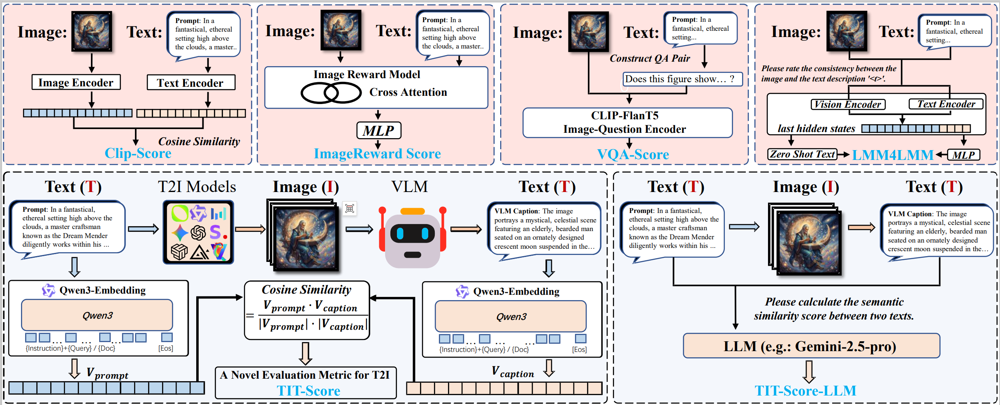

# TIT-Score: Evaluating Long-Prompt Text-to-Image Alignment via Text-to-Image-to-Text Consistency

[](https://opensource.org/licenses/MIT)



This repository provides code, examples, and resources for evaluating long-prompt text-to-image (T2I) alignment with **TIT** (Text-to-Image-to-Text consistency).

Our work focuses on a key challenge in T2I evaluation: measuring whether generated images faithfully follow **long, detailed, and highly compositional prompts**. To support this setting, we provide:

1. **LPG-Bench**: a benchmark designed for long-prompt T2I evaluation.
2. **TIT**: a zero-shot evaluation framework that decouples image understanding from semantic matching.
3. **TIT-Score / TIT-Score-LLM**: two practical instantiations of the TIT framework.

---

## 🚀 Overview

### LPG-Bench
LPG-Bench is a benchmark for evaluating long-prompt instruction following in text-to-image models.

- **1,000 long prompts** in total
- **200 human-annotated prompts** for metric validation
- **800 additional prompts** for large-scale model evaluation
- Prompts are long and semantically dense, with an average length of **over 250 words**
- Images are collected from **13** recent text-to-image models, resulting in approximately **13,000 generated images**
- The annotated subset includes **12,832 non-tie pairwise human preference comparisons**

### TIT Framework
TIT (**Text-to-Image-to-Text consistency**) is a **zero-shot, training-free** evaluation framework for long-prompt T2I assessment.

Instead of directly scoring image-prompt alignment in a single cross-modal step, TIT decomposes the process into two stages:

1. A **vision-language model (VLM)** generates a detailed textual description of the image.
2. A **text-domain evaluator** compares the generated description with the original prompt.

This decoupled design makes long-prompt evaluation more tractable and better suited to fine-grained semantic comparison.

### Two Instantiations
- **TIT-Score**: an efficient embedding-based version that computes similarity between the prompt and the generated image description in the text domain.
- **TIT-Score-LLM**: a stronger variant that uses a large language model for finer-grained text-text consistency judgment.

---

## 🛠️ Getting Started

### Installation

1. **Clone the repository**
   ```bash
   git clone https://github.com/IntMeGroup/TIT-Score.git
   cd TIT-Score
   ```

2. **Create a conda environment**
   ```bash
   conda create -n tit-score python=3.10 -y
   conda activate tit-score
   ```

3. **Install PyTorch**
 
   Please install a recent version of PyTorch following the official instructions at [pytorch.org](https://pytorch.org/), based on your platform and CUDA environment.

4. **Install dependencies**
   ```bash
   pip install transformers
   ```

---

## 📦 Download LPG-Bench

The benchmark dataset **LPG-Bench** is hosted on Hugging Face Hub.

> Note: some annotation-related files may be organized and updated incrementally.

### Standard download
```bash
huggingface-cli download --repo-type dataset --resume-download Moyao001/LPG-Bench --local-dir LPG-Bench
```

### For users in mainland China
If direct access is unstable, you may use a mirror endpoint:

```bash
export HF_ENDPOINT=https://hf-mirror.com
huggingface-cli download --repo-type dataset --resume-download Moyao001/LPG-Bench --local-dir LPG-Bench
```

---

## 📊 Usage

### Evaluate a Single Image with TIT-Score

The example below demonstrates a basic **TIT-Score** pipeline:

- use a VLM to describe the image
- use a text embedding model to compare the generated description with the original prompt

You may choose different VLM and embedding backbones. A practical combination is:
- **Qwen2.5-VL** for image description
- **Qwen3-Embedding** for text similarity

```python
import torch
import torch.nn.functional as F
from torch import Tensor
from transformers import AutoProcessor, AutoModelForCausalLM, AutoTokenizer, AutoModel

# This utility is provided by the Qwen-VL team.
# Ensure qwen_vl_utils.py is in the same directory or in your python path.
from qwen_vl_utils import process_vision_info

# --- 1. Configuration: Model Paths ---
# Update these paths to your local model directories.
VLM_MODEL_PATH = "/path/to/your/Qwen2.5-VL-72B-Instruct"
EMBEDDING_MODEL_PATH = "/path/to/your/Qwen3-Embedding-8B"

# --- 2. Helper Function ---
def last_token_pool(last_hidden_states: Tensor, attention_mask: Tensor) -> Tensor:
    """Pool the last hidden state to obtain a sentence embedding."""
    left_padding = (attention_mask[:, -1].sum() == attention_mask.shape[0])
    if left_padding:
        return last_hidden_states[:, -1]
    else:
        sequence_lengths = attention_mask.sum(dim=1) - 1
        batch_size = last_hidden_states.shape[0]
        return last_hidden_states[
            torch.arange(batch_size, device=last_hidden_states.device),
            sequence_lengths
        ]

# --- 3. Initialization ---
print("Loading models, please wait...")
device = "cuda" if torch.cuda.is_available() else "cpu"

# Load VLM for image description
try:
    vlm_processor = AutoProcessor.from_pretrained(VLM_MODEL_PATH, trust_remote_code=True)
    vlm_model = AutoModelForCausalLM.from_pretrained(
        VLM_MODEL_PATH,
        torch_dtype=torch.bfloat16,
        device_map="auto",
        trust_remote_code=True
    ).eval()
    print("VLM loaded successfully.")
except Exception as e:
    print(f"Error loading VLM: {e}")
    exit()

# Load text embedding model
try:
    embedding_tokenizer = AutoTokenizer.from_pretrained(
        EMBEDDING_MODEL_PATH,
        padding_side='left',
        trust_remote_code=True
    )
    embedding_model = AutoModel.from_pretrained(
        EMBEDDING_MODEL_PATH,
        trust_remote_code=True
    ).to(device).eval()
    print(f"Embedding model loaded to {device}.")
except Exception as e:
    print(f"Error loading embedding model: {e}")
    exit()


def calculate_tit_score(image_path, original_prompt):
    """
    Compute TIT-Score for a given image and prompt.
    """
    print("\n--- Calculating TIT-Score ---")

    # Step 1: Generate image description with a VLM
    print("Step 1/2: Generating image description...")
    try:
        vlm_description_prompt = (
            "Please provide a detailed, single-paragraph description of the image in English, "
            "using between 250 and 350 words."
        )

        messages = [{
            "role": "user",
            "content": [
                {"type": "image", "image": image_path},
                {"type": "text", "text": vlm_description_prompt},
            ],
        }]

        text_for_vlm = vlm_processor.apply_chat_template(
            messages,
            tokenize=False,
            add_generation_prompt=True
        )
        image_inputs, _ = process_vision_info(messages)

        inputs = vlm_processor(
            text=[text_for_vlm],
            images=image_inputs,
            padding=True,
            return_tensors="pt"
        ).to(vlm_model.device)

        generated_ids = vlm_model.generate(**inputs, max_new_tokens=512)
        generated_ids_trimmed = [
            out_ids[len(in_ids):] for in_ids, out_ids in zip(inputs.input_ids, generated_ids)
        ]

        response = vlm_processor.batch_decode(
            generated_ids_trimmed,
            skip_special_tokens=True,
            clean_up_tokenization_spaces=False
        )
        image_description = response[0].strip()
        print("Description generated successfully.")

    except FileNotFoundError:
        print(f"Error: Image not found at {image_path}")
        return None
    except Exception as e:
        print(f"Error during VLM inference: {e}")
        return None

    # Step 2: Compute text-text semantic similarity
    print("Step 2/2: Calculating semantic similarity...")
    try:
        input_texts = [original_prompt, image_description]

        batch_dict = embedding_tokenizer(
            input_texts,
            padding=True,
            truncation=True,
            max_length=8192,
            return_tensors="pt"
        ).to(device)

        with torch.no_grad():
            outputs = embedding_model(**batch_dict)

        embeddings = last_token_pool(outputs.last_hidden_state, batch_dict['attention_mask'])
        normalized_embeddings = F.normalize(embeddings, p=2, dim=1)

        final_score = F.cosine_similarity(
            normalized_embeddings[0].unsqueeze(0),
            normalized_embeddings[1].unsqueeze(0)
        ).item()

        final_score = round(final_score, 4)
        print("Score calculation complete.")
        return final_score

    except Exception as e:
        print(f"Error during similarity calculation: {e}")
        return None


# --- 4. Example Usage ---
if __name__ == "__main__":
    test_image_path = "/path/to/your/image.jpg"
    test_original_prompt = (
        "In the vast emptiness of space, an isolated astronaut stands as the sole guardian of an abandoned space station. "
        "This astronaut is clad in a worn and slightly tattered space suit, indicative of the many missions they have "
        "undertaken and the countless hours spent in the cosmos."
    )

    tit_score = calculate_tit_score(test_image_path, test_original_prompt)

    if tit_score is not None:
        print("\n=========================")
        print(f"  Final TIT-Score: {tit_score}")
        print("=========================")
    else:
        print("\nFailed to calculate TIT-Score.")
```

---

## 📚 Notes

- TIT is designed for **long-prompt** evaluation, where prompts often include dense constraints on objects, attributes, relations, scene composition, and style.
- The quality of the final score depends partly on the first-stage image description. Better VLM describers usually lead to stronger evaluation quality.
- TIT-Score is typically more efficient and easier to reproduce, while TIT-Score-LLM can support finer-grained semantic comparison.

---

## 📄 License

This project is licensed under the MIT License. See the [LICENSE](LICENSE) file for details.
